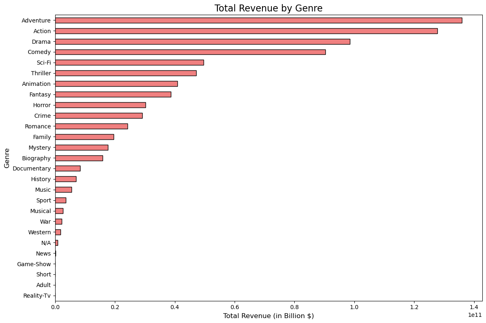
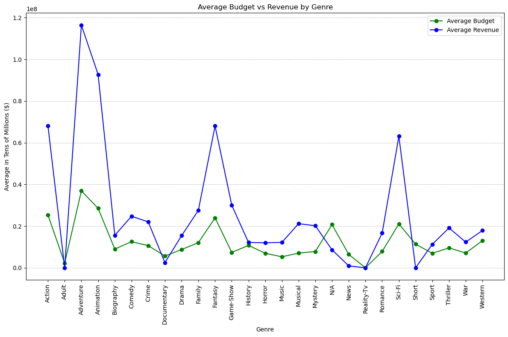
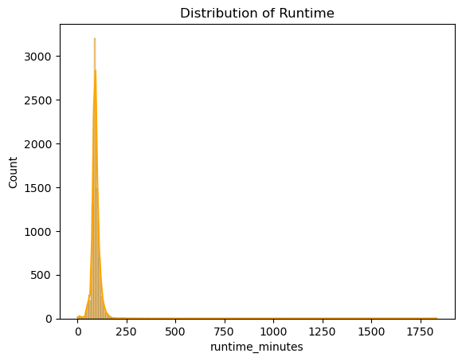

# Movie-Data-Analysis
## Overview
This project analyzes movie data collected from TMDB and IMBD websites which combined had more than 15,000 titles. Descriptive analysis of the genre performance and budget shows that some genres are capital intensive but yield good returns. The new studio can use this data to decide on what genres to focus on and invest in. 
## Business Understanding
The studio may be able to leverage the insight to decide on what genres to invest heavily in and choose genres that resonate well with the viewers. Doing so may guarantee good returns on investment to ensure viewer satisfaction.
## Data
[TMDB](https://www.themoviedb.org/) and [IMDB](https://www.imdb.com) are popular movie rating websites with over 200,000 titles combined. Every title has a unique I.D . The data files provide the title's genre, runtime, popularity, revenue accrued and production budget.
## Methods
This project uses descriptive analysis, statistical analysis applying methods such as linear regression to gain insight into the data. This provides useful recommendations to the studio on which niches to invest in.
## Results
Genres such as Adventure,  Action, and Comedy had the highest revenue returns.

Genres such as Adventure,  Action, and Fantasy and Animation had the highest returns on input.

Most titles align with a 90–120-minute preference. 


## Conclusions
• **High Revenue Genres**: Adventure, Fantasy, and Sci-Fi generate higher revenues.
• **Steady Performers**: Drama, Comedy, and Thriller offer consistent returns.
• **Budget vs. Return**: Adventure, Sci-Fi and Animation need higher budgets but yield big
returns.
• **Cost-Effective**: Drama and Documentaries balance lower budgets with steady
engagement.

## Next steps
• Better predict highly profitable sub-genres e.g. action-animation.
• Build model to analyze movies and recommend related titles

## For More Information
See the full analysis in this [Jupyter Notebook](./NOTEBOOK.ipynb) or review this [presentation](./presentation.pdf)

## Repository Structure

```
├── Data
├── group_submissions
├── images
├── NOTEBOOK.ipynb
├── README.md
└── presentation.pdf
```
